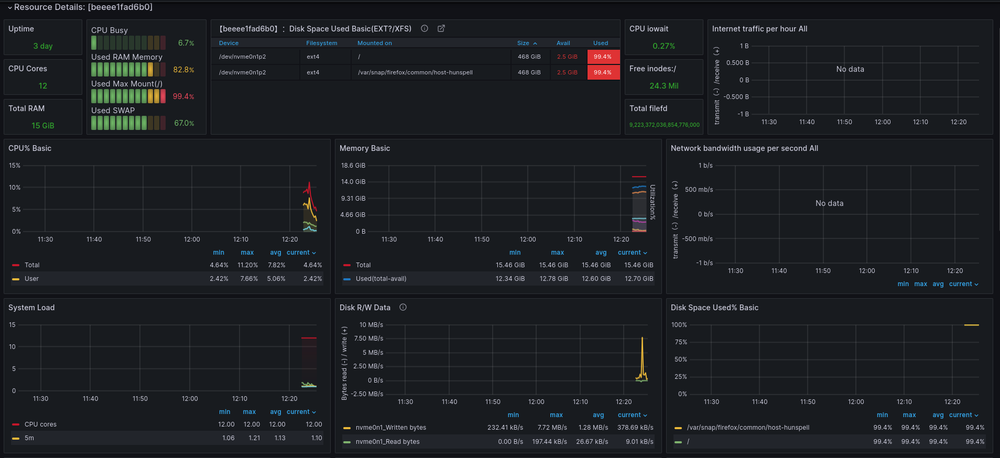
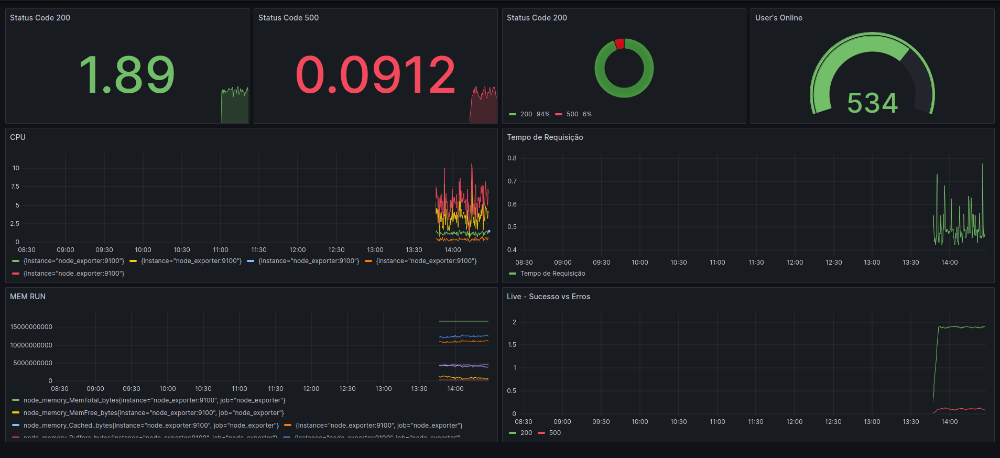

# Observabilidade - Métricas
- link do dashboard: https://grafana.com/grafana/dashboards/15172-node-exporter-for-prometheus-dashboard-based-on-11074/

# INSTALL
- git clone: https://github.com/acambinza/grafana_prometheus.git
- cd grafana_prometheus
- docker-compose up -d
- grafana: http://localhost:3000 [user: admin, pwd: admin]
- import o dashbord Node Exporter, nas pasta dashboards

Obs.: O node exporter, apenas vai trazer os recursos da máquina física, se pretende visualizar 
as métricas da sua aplicação, o desenvolvedor deve criar esses metricas na sua aplicação e expô-las na route /metrics
a seguir, poderá adicionar a sua app no ficheiro de configuração do prometheus, só depois irá desenhar os
dashboards no grafana. Na pasta app_example, tem uma aplicação de exemplo, feita com o node js. 

### APP METRICS - EXAMPLE
- acesse: http://localhost:3001/metrics
    -- total de requisicoes
    -- total de usuario logados na app
    -- tempo de resposta da App

